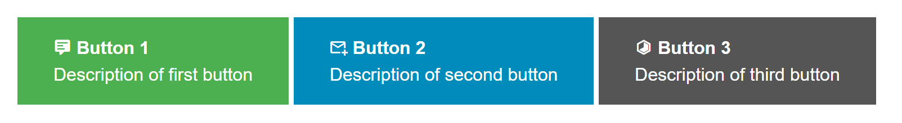
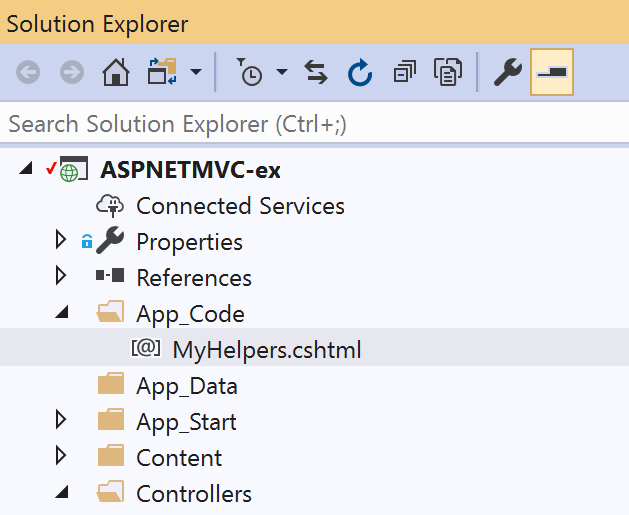

DRY (Don't Repeat Yourself) is a useful mantra on the way to 
maintainable, readable code, and ASP.NET MVC (with Razor view-engine)
gives you multiple ways to remove unnecessary redundancy in your views.

## @helper Methods

The @helper method syntax gives you the ability to package up a small bit of
markup and embeded C# server-side code in a reusable function that can be
called from the view.  When embedded in the view page itself it also has
access to any of the page's variables (including the Model).

Consider a view that contains four buttons, each of which has:
* A title
* Some explanatory text
* An icon
* A CSS class to apply colors
* An MVC action that should be called when clicked 

The desired output looks like this:

And here's the markup to create it:

##### HelperInPage.cshtml

 
<a href='@Url.Action("Action1")'
   class="buttonex buttonex-1">
    

        <i class="mdi mdi-comment-text"></i>
        <b>Button 1</b>
        
Description of first button

    

</a>

<a href='@Url.Action("Action2")'
   class="buttonex buttonex-2">
    

        <i class="mdi mdi-email-plus-outline"></i>
        <b>Button 2</b>
        
Description of second button

    

</a>

<a href='@Url.Action("Action3")'
   class="buttonex buttonex-3">
    

        <i class="mdi mdi-hexagon-slice-4"></i>
        <b>Button 3</b>
        
Description of third button

    

</a>


It's pretty clear there is a lot of repetition going on here.

At the bottom of the view we can make use of the @helper syntax to
create a re-usable function:


@helper ActionButton(
    string title, string description,
    string buttonCssClass, string iconCssClass,
    string action)
{
    <a href='@Url.Action(action)'
       class="buttonex @buttonCssClass">
        

            <i class="mdi @iconCssClass"></i>
            <b>@title</b>
            
@description

        

    </a>
}


Which simplifies our buttons down to this:

    @ActionButton("Button 1", "Description of first button", "buttonex-1", "mdi-comment-text", "Action1")
    @ActionButton("Button 2", "Description of second button", "buttonex-2", "mdi-email-plus-outline", "Action2")
    @ActionButton("Button 3", "Description of third button", "buttonex-3", "mdi-hexagon-slice-4", "Action3")


## @helper Methods -- Shared in App_Code

Helper methods don't only have to live in a single view page.
If you have a snippet that should be shared 
you can store this helper method definition in a Razor view page under
App_Code.

* Create a directory "App_Code" directly under the solution root
  (if it doesn't already exist)
* Create a file "MyHelpers.cshtml" for example.

Move our ActionButton helper to the MyHelpers.cshtml page.

