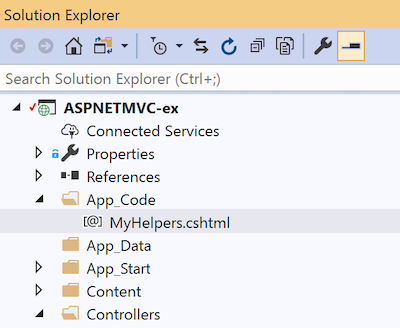

DRY (Don't Repeat Yourself) is a useful mantra when developing 
maintainable, readable code. ASP.NET MVC (with Razor view-engine)
gives you multiple ways to remove unnecessary redundancy in your views.

## Approach 1: @helper Methods

The @helper method syntax gives you the ability to package up a small bit of
markup and embeded C# server-side code in a reusable function that can be
called from the view.  When embedded in the view page itself it also has
access to any of the page's variables (including the Model).

Consider a view that contains four buttons, each of which has:
* A title
* Some explanatory text
* An icon
* A CSS class to apply colors
* An MVC action that should be called when clicked 

The desired output looks like this:

And here's the markup to create it:

##### HelperInPage.cshtml

 
<a href='@Url.Action("Action1")'
   class="buttonex buttonex-1">
    

        <i class="mdi mdi-comment-text"></i>
        <b>Button 1</b>
        
Description of first button

    

</a>

<a href='@Url.Action("Action2")'
   class="buttonex buttonex-2">
    

        <i class="mdi mdi-email-plus-outline"></i>
        <b>Button 2</b>
        
Description of second button

    

</a>

<a href='@Url.Action("Action3")'
   class="buttonex buttonex-3">
    

        <i class="mdi mdi-hexagon-slice-4"></i>
        <b>Button 3</b>
        
Description of third button

    

</a>


It's pretty clear there is a lot of repetition going on here.

At the bottom of the view we can make use of the @helper syntax to
create a re-usable function:


@helper ActionButton(
    string title, string description,
    string buttonCssClass, string iconCssClass,
    string action)
{
    <a href='@Url.Action(action)'
       class="buttonex @buttonCssClass">
        

            <i class="mdi @iconCssClass"></i>
            <b>@title</b>
            
@description

        

    </a>
}


Which simplifies our buttons down to this:

    @ActionButton("Button 1", "Description of first button", "buttonex-1", "mdi-comment-text", "Action1")
    @ActionButton("Button 2", "Description of second button", "buttonex-2", "mdi-email-plus-outline", "Action2")
    @ActionButton("Button 3", "Description of third button", "buttonex-3", "mdi-hexagon-slice-4", "Action3")


## Approach 2: @helper Methods -- Shared in App_Code

Helper methods don't only have to live in a single view page.
If you have a snippet that should be shared 
you can store this helper method definition in a Razor view page under
App_Code.

* Create a directory "App_Code" directly under the solution root
  (if it doesn't already exist)
* Create a file "MyHelpers.cshtml" for example.

Move our ActionButton helper to the MyHelpers.cshtml page.

---
##### Note

One minor down-side of placing a @helper method in App_Code is that the UrlHelper and HtmlHelper classes  are not available.  You can overcome this in a couple of ways, but the simplest is to just pass in the Url helper from the caller. 

---

##### App_Code/MyHelpers.cs

@using System.Web.Mvc

@helper ActionButton(
    string title, string description,
    string buttonCssClass, string iconCssClass,
    string action,
    UrlHelper Url) // Notice that UrlHelper is passed from the caller
{
    <a href='@Url.Action(action)'
       class="buttonex @buttonCssClass">
        

            <i class="mdi @iconCssClass"></i>
            <b>@title</b>
            
@description

        

    </a>
}


Which gives us this slightly modified usage in the view.

##### HelpersInAppCode.cshtml

@MyHelpers.ActionButton("Button 1", "Description of first button",
    "buttonex-1", "mdi-comment-text", "Action1", Url)
@MyHelpers.ActionButton("Button 2", "Description of second button",
    "buttonex-2", "mdi-email-plus-outline", "Action2", Url)
@MyHelpers.ActionButton("Button 3", "Description of third button",
    "buttonex-3", "mdi-hexagon-slice-4", "Action3", Url)


You can find more information about ASP.NET helper syntax here:
[Creating and Using a Helper in an ASP.NET Web Pages (Razor) Site](https://docs.microsoft.com/en-us/aspnet/web-pages/overview/ui-layouts-and-themes/creating-and-using-a-helper-in-an-aspnet-web-pages-site)

## Approach 3: Partial Views

Partial views are .cshtml pages that are not used on their own, but
are instead included as part of another page.  One great use is for
breaking apart a complicated or large page in to more managable
units -- rendering the Menu Bar, Side Bar, and Footer as separate
components, for example.

Partial views can live either under a specific View's directory,
when used to decompose a complicated view in to smaller units, or
under the Views/Shared directory, when used in multiple views.  Partial views are
named with a leading underscore to differentiate them.

As a simple example, consider a reusable partial view that renders
messages.

Create a view model to contain information about the message to
be displayed, and store it under the Models directory.

##### Models/MessageViewModel.cs

public class MessageViewModel
{
    public string Title { get; set; }
    public string Message { get; set; }
    public string CssClass { get; set; }
}


Create the partial view under Views/Shared so it can be re-used across pages.

##### Views/Shared/\_Message.cshtml

@model ASPNETMVC_ex.Models.MessageViewModel

    

        <b>@Model.Title</b>
    

    

        @Model.Message
    



The \_Message partial view can then be used to render messages.
`

@Html.Partial("_Message", new MessageViewModel
{
    Title = "Warning",
    Message = "The supplied machine ID is not valid.  Please check " +
        "the value and re-submit.",
    CssClass = "bg-danger text-light"
})

`

## Approach 4: View Templates

