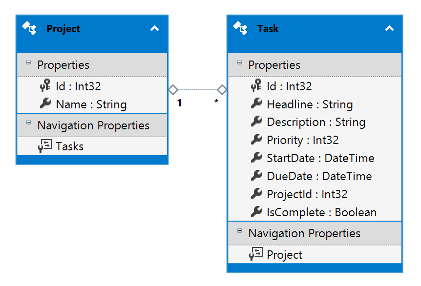

The "let" clause is useful in LINQ for re-using bits of a select
or avoiding redundant computations.  For illustration purposes,
we pretend we're developing a simple task manager.  Computing an
"Importance" score for each task, and stowing it using a let 
assignment allows it to be used in the sort criteria, the filter,
and in the select clause.

## Example: A Project Task Manager

Consider a task manager project with the below database
design.

Projects can be composed of multiple task entries.
Each task has attributes like:
* A start date
* A due date
* A priority
* A completion status

## The Requirements

Suppose our task manager has the following requirement:

Every task should be assigned an importance score that is
derived from factors such as the task's due date and whether it
is completed.

This importance score is used to:
* sort important tasks to the top of a list
* filter so only tasks with a given score are shown
* allow the front-end to highlight important tasks via an icon or background color

For our example, we compute the importance score like this:
* Any task gets a +50 importance on their start date
* Any task that should already be started (the start date has already past)
  gets +10
* If a task is due today (or already overdue) the importance is +100
* Completed tasks don't get any of the above scores
* The priority of the task (from 1 - 3) is then applied


Database1Entities db = new Database1Entities();

DateTime Today = DateTime.Today;

int MinimumImportance = 50;

IQueryable<TaskViewModel> taskQuery =
    from t in db.Tasks

    let _importance = 
        t.Priority + 
        (!t.IsComplete && t.StartDate == Today ? 50 : 0) +
        (!t.IsComplete && t.StartDate > Today ? 10 : 0) +
        (!t.IsComplete && t.DueDate >= Today ? 100 : 0)

    where _importance >= MinimumImportance
    orderby _importance descending

    select new TaskViewModel
    {
        ProjectName = t.Project.Name,
        ProjectId = t.ProjectId,
        TaskHeadline = t.Headline,
        TaskId = t.Id,
        TaskPriority = t.Priority,
        TaskStart = t.StartDate,
        TaskDue = t.DueDate,
        TaskDescription = t.Description,
        IsComplete = t.IsComplete,
        Importance = _importance
    };

return View();


If the importance score were not stowed in a let clause, we would have to 
repeat the calculation in the "where", the "orderby", and finally in the "select"
where it is stored in the Importance variable of the View Model.

This repetition would make it easy to have an error where the rules
were changed in one location and became out of sync with the duplicate
copies.

There are other approaches to this problem, of course, such as
doing the initial query and computation of importance score in one
LINQ expression that is then data-shaped and stored in a View Model.

A second LINQ expression could select from the first and use the computed
Importance.  In many cases, however, the let clause allows you to avoid
redundancy without composing the query in multiple statements.