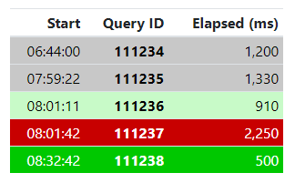
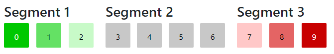

In this post we'll look at a simple one-file JavaScript module that
generates color ramps (lists of colors arranged in a linear gradient).
The colors can be applied to data
to highlight items of interest.  Foreground (text) color
is chosen automatically for visibility against the backgound color.

## Overview

When displaying data you can give the viewer cues to help them
identify outliers, trends, and max or min values.  This could be via
sorting, graphing, icons, or other approaches.  

Or, as described here, colors can be used to give the viewer hints
about which items they should focus on.  (Of course you should never
depend exclusively on color to present data as some of your users
may have trouble diffentiating between colors or may rely on 
screen-readers.)

Here's an example table displaying fictional database report
times where rows with longer than normal response times
are flagged in shades of red and those with shorter than normal times
are flagged in green.

<!-- ## Design Criteria

* Client Side Calculation

    Although either client or server-calculated is a
    vaild approach, for this post we'll do all calculations client-side
    in JavaScript.

* Multiple "Ranges" 

    Depending on the use case you may want a series of critical values
    (shades of red), neutral values (shades of gray), and positive values
    (shades of green).  It isn't enough to simply make a gradient between
    two fixed color values. -->

## The rgbramp.js Module

The module exposes two classes, Rgb, and Segment.

* Rgb

    Encodes the Red, Green, and Blue values for a color, 
    and provides utility functions for computing the HTML color
    code, and calculating the contrasting text color.

* Segment

    Stores a starting color (Rgb), ending color, and total number
    of colors in the gradient (including the start and end
    color).

And, three functions:

* ramp()

    Given an array of Segments and the number of colors in each
    segment it interpolates the colors for each segment and returns
    them all as an array of Rgb objects.

* applyColors()

    Given a list of Rgb objects defining the gradient(s), 
    apply appropriate colors from this list based on the value
    of a data-attribute on each item.  This function will collect
    all the data values, determine the minimum and maximum value
    and will determine the correct color to apply to each
    element.

* applyColorsIndex()

    This function is similar to applyColors() but rather than
    computing each index it assumes the data value is an
    index to use from the colors array.  (This will be clearer
    from the example below.)

## Usage

First include the symbols needed from the rgbramp module:


import { Rgb, Segment, ramp, applyColors, applyColorsIndex } 
	from '/rgbramp.js';


Define the endpoints of the color ranges and compute all the colors:


let colors = ramp(
	new Segment(new Rgb(0, 200, 0), new Rgb(200, 250, 200), 3),
	new Segment(new Rgb(200, 200, 200), new Rgb(200, 200, 200), 4),
	new Segment(new Rgb(255, 200, 200), new Rgb(200, 0, 0), 3)
);


Here's a visualization of the computed colors.
They are returned in an array of Rgb objects with 3 for the 
first (green) segment, 4 for the second (gray) segment,
and 3 for the third (red) segment.

Next define the elements to be colorized.
In this case we'll define a table where each row has a "data-val"
attribute that holds the number of milliseconds of response time.


<table class="table table-sm">
	<thead>
		<tr>
			<th>Start</th>
			<th>Query ID</th>
			<th>Elapsed (ms)</th>
		</tr>
	</thead>

	<tbody>
		<tr data-val="1200">
			<td>06:44:00</td>
			<th>111234</th>
			<td>1,200</td>
		</tr>
		<tr data-val="1330">
			<td>07:59:22</td>
			<th>111235</th>
			<td>1,330</td>
		</tr>
		<tr data-val="910">
			<td>08:01:11</td>
			<th>111236</th>
			<td>910</td>
		</tr>
		<tr data-val="2250">
			<td>08:01:42</td>
			<th>111237</th>
			<td>2,250</td>
		</tr>
		<tr data-val="500">
			<td>08:32:42</td>
			<th>111238</th>
			<td>500</td>
		</tr>
	</tbody>
</table>


Finally, call applyColors().  Notice that this function takes the 
colors array we obtained from the call to ramp().

It will first collect the values from all elements on the page
with a "data-val" attribute, determine the minimum and maximum value,
and will compute the proper index in to the color array based on the
value for each item.  It will then set the color and background-color
styles.


applyColors('data-val', colors);


Resulting in the table we saw in the Overview:

You can get the code for this post here:
 [GitHub | johnharp/rgbramp](https://github.com/johnharp/rgbramp)
